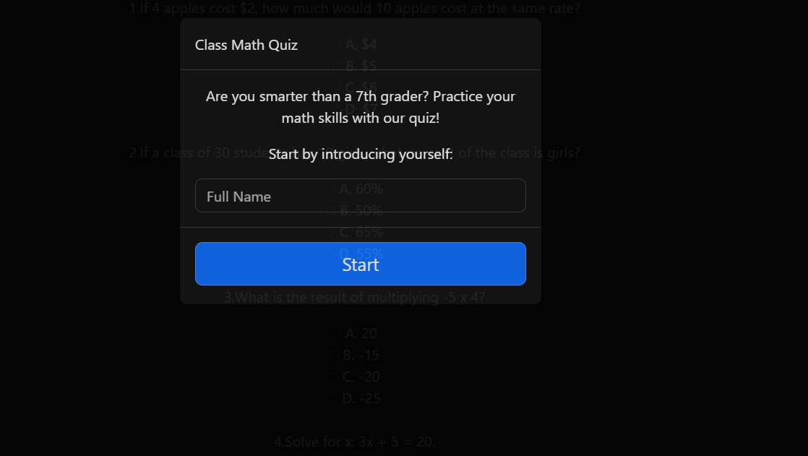
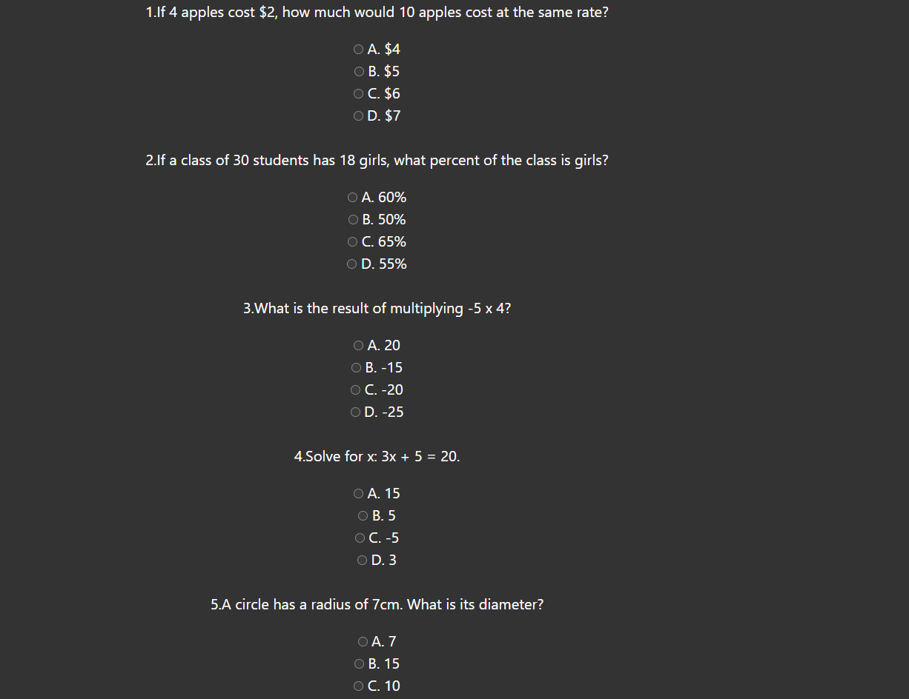

# 7th Grade Math Quiz

*School can be stressful.  Why should keeping up with educational growth be one of those stressors?  With our application, we make keeping up with educational goals simple and easy for both teachers and students on ANY grade level!

*As a 7th grade math student
I WANT to be able to study what I have learned to this point
SO THAT I can show and use my new knowledge to further my educational goals

## Acceptance Criteria

*It is done when I have created a math study guide webpage

*It is done when I click on start quiz, the first question appears

*It is done when a timer also starts when start quiz is clicked

*It is done when a score counter moves up 1 with a correct response or stays the same with an incorrect response

*It is done when an answer is chosen, an alert shows if the answer is correct or not correct and the box changes to green if correct or red if not correct.

*It is done when I click on the next question button, the next question appears

*It is done when I click the submit button that my quiz score is shown

*Techonologies Used: Bootstrap, W3Schools, StackOverflow

https://troublemonkey0322.github.io/Project-1---Quiz/